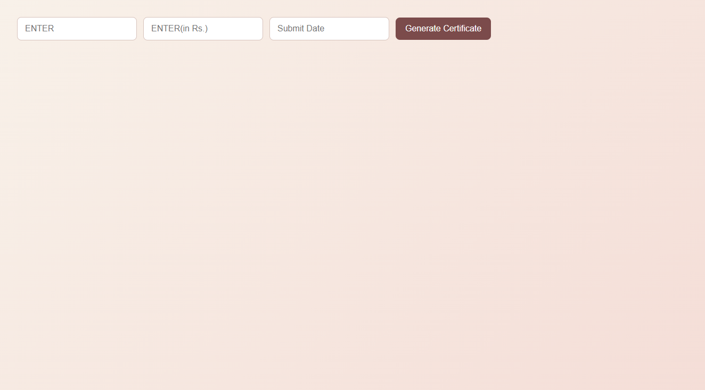
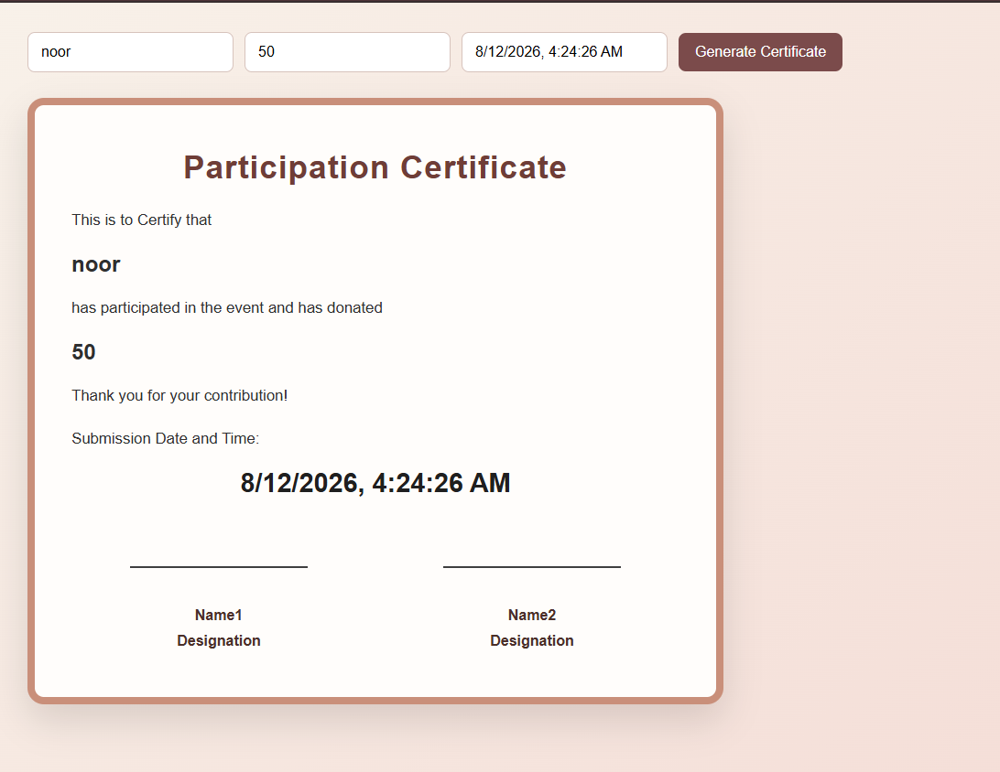

# SD-assign-1404

This repository contains practice work and assignment files for SD.

## Repository Structure

```text
SD/
├─ mydaywiselearning/
│  ├─ day1.html
│  └─ day1.js
├─ SD_assign_sir_task/
│  ├─ index.html
│  └─ certificate_project/
│     ├─ index.html
│     ├─ style.css
│     └─ certificate.js
└─ README.md
```

## Projects

### 1) Day 1 Learning

Location: mydaywiselearning

- day1.html: Simple student page with heading and submit button.
- day1.js: Adds a click event on the button and shows an alert.

### 2) Certificate Generator

Location: SD_assign_sir_task/certificate_project

- index.html: Form fields, certificate layout, signature placeholders.
- style.css: Styling for form, certificate card, and responsive layout.
- certificate.js: Handles form submission, populates certificate values, sets current date and time, and displays the certificate.

## Certificate Generator Features

- Input fields for participant name and donation amount.
- Submit date and time is auto-filled at submission time.
- Certificate is hidden initially and shown only after clicking Generate Certificate.
- Two signature placeholder sections are included at the bottom.

## How to Run

Option 1:
- Open SD_assign_sir_task/certificate_project/index.html in a browser.

Option 2 (recommended for development):
- Open this repository in VS Code.
- Use Live Server or Five Server to run SD_assign_sir_task/certificate_project/index.html.

## Usage Flow (Certificate Generator)

1. Enter participant name.
2. Enter donation amount.
3. Click Generate Certificate.
4. The app displays:
	- Name
	- Donation amount
	- Current submission date and time
5. Certificate card becomes visible with signature placeholders.

## Notes

- The date input is read-only and managed by JavaScript.
- The current date/time format uses the browser locale via toLocaleString().

## Progress Till Now

### 1) Initial Screen (Before Certificate Generation)



### 2) Generated Certificate Screen



### What Is Completed

- Certificate form UI with name, donation, and submit date input.
- Auto date-time fill at the time of submission.
- Certificate container hidden by default and shown on click.
- Signature placeholders added inside certificate.
- Styling for certificate card and responsive input layout.

### Screenshot File Placement

Place your two screenshot files in:

- docs/screenshots/before.png
- docs/screenshots/generated.png
